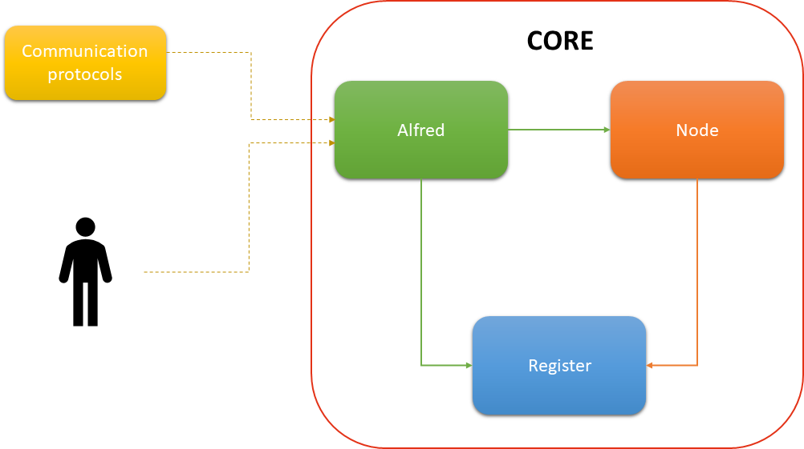

Library Design
---

The present section is actually focused on Java library. When other platform become available the diferrence between platform went higlighted.

The Uniquid Library is divided in three components:

* **Alfred**
* **Node**
* **Register**

Below is reported a graphic schema  that illustrate the library's logical areas.

### Alfred
As a good butler, it takes care of accessing and communicating various protocols (MQTT, HTTP, etc...) with the library. 
Alfred offers the ProviderCore interface for message exchange with library and additional functionality management. 
Before making a request, verify that the sender has permission to do so. Allows you to instantiate:

* Request and Response interfaces
* Additional functionality management interfaces
    
ProviderRequest provides methods for a request. Similarly, ProviderResponse provides methods for responding to a received request.

### Registrer
The Registrer is the component to which device data management and persistence is charged.  
all fine te stava a richiamà tu moje ? It is independent of the type of storage you choose (SQLite, text files, etc...). 
Provides 4 interfaces for handling and persistences of storage data, one for each bean.  
It also provide an additional interface that allows you to instantiate the Data Access Object.
Register defines 4 bean:

* UserContract
* ProviderContract
* RevokerContract
* Context
    

### Node
It's the interface from the library that implements the SPV Node handling key creation and usage, communication with the blockchain, and all those features of Wallet SPV. 
The interface provide the layers with the Wallet library chosen by the user (BitcoinJ, BitcoinSPV, etc...).
It has an UniquidNode interface for managing Wallet features, from communicating with the Blockchain to receiving contracts.  
The UniquidNode also has a listener to intercept the arrival of user/provider contracts, whether they are created or revoked. 
It also instatiate the UniquidContext interface for context management where the Node is present and its contracts.  
To get information about a contract, there is the UniquidContract interface that provides the methods that you need. Within a specific context, the 

Node is identified by a state:

* Created
* Imprinting
* Ready
___